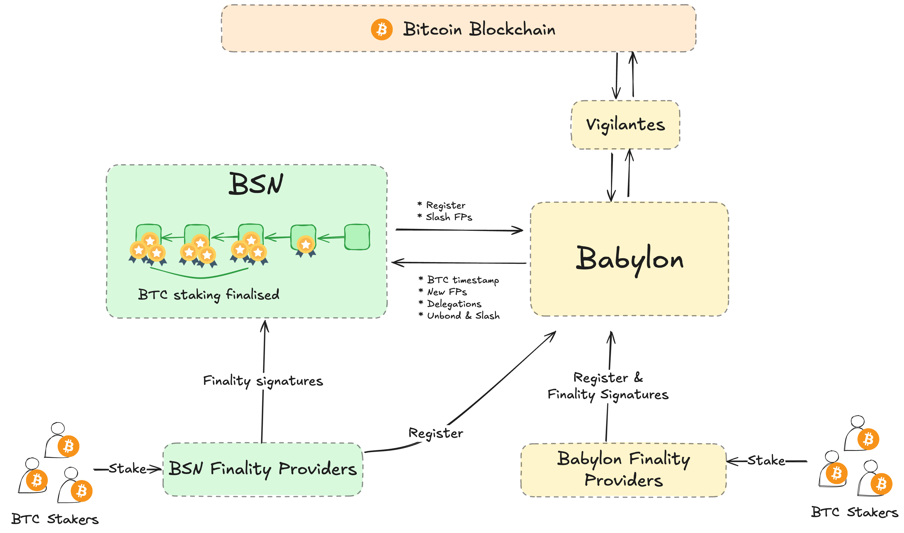
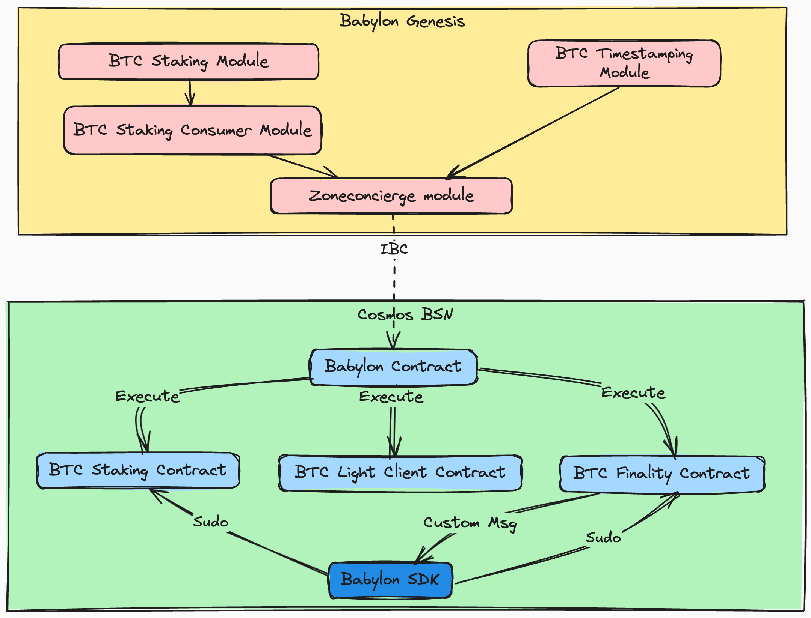

# Cosmos BSN BTC Staking Integration Architecture

## System architecture

The following figure depicts the overall system architecture.

The design involves the following main parts:

- **Finality provider:** a daemon program that receives BTC stake and keeps
  submitting finality signatures over blocks to the consumer chain.
  - It connects to a consumer chain node to query block metadata.
  - It connects to the smart contracts on the Cosmos BSN chain for querying
  voting power and submitting finality signatures.

  Upon a new block in the Cosmos BSN chain:

  - It Gets the block metadata.
  - Queries the smart contracts on the BSN chain to determine whether it has
    voting power at this height.
  - If yes, it signs and submits a finality signature to the Babylon contracts.

- **[Cosmos BSN contracts](https://github.com/babylonlabs-io/cosmos-bsn-contracts)**:
  A set of CosmWasm smart contracts, implemented in this repository, that
  maintain IBC channels with Babylon Genesis, and handle finality signatures
  submitted from finality providers.

  These contracts:
  - Will be deployed on the Cosmos BSN chain.
  - Establish an IBC channel with Babylon Genesis. The IBC channel relays
  information about BTC headers, BTC timestamps, and BTC staking.
  - Determines the voting power of BSN finality providers.

  Upon a finality signature, the BSN contracts verify it:

  - If invalid, reject.
  - If valid and non-conflicting with any existing ones, accept.
  - If valid but conflicting with an existing finality signature, it sends an
  IBC packet to Babylon Genesis.
  Babylon Genesis then emits an event, so that anyone can slash the finality
  provider and the BTC stake under it.

- **[Babylon-SDK](https://github.com/babylonlabs-io/babylon-sdk)**:
  A Cosmos SDK module serving as a thin layer between the BSN
  contracts and the Cosmos SDK of the Cosmos BSN chain.
  - It sends a privileged (sudo) messages to the smart contracts upon each
  `BeginBlock`, so that the contracts can update the voting power table, and
  tally blocks.
  - It moves part of the rewards from the fee collector account to the smart
  contracts, so that the contracts can transfer the rewards to Babylon Genesis.

## Modules and Contracts

You can get a good overview of the whole system flow in the above diagram.
The design allows Babylon to provide Bitcoin-based security to multiple chains.

### Babylon Genesis

On Babylon Genesis, the main module is the `x/btcstaking` module, which
provides the functionality of Babylon Staking integration. It is responsible
for tracking the staking and unstaking of BTC, as well as providing the
finality providers with the necessary information to operate.
There's also a `x/btcstkconsumer` module, which is responsible for managing the
staking part that is specific to the BSN chains.
The `x/btcstkconsumer` module interacts with the `x/zoneconcierge` module, which
is responsible for managing the restaking of BTC on the Bitcoin Supercharged
Networks (BSNs).
The Cosmos BSNs are a network of Cosmos chains that are integrated with Babylon
Staking, and receive economic security from Bitcoin.

### Cosmos BSN

On the Cosmos BSN, the main contract is the `btc-staking` contract, which is
responsible for tracking the staking and unstaking of BTC on the BSN.
It has the necessary information related to delegations of Bitcoin on the BSN.
The `btc-staking` contract interacts with Babylon Genesis through the `babylon`
smart contract, which is responsible for managing the communication between
Babylon and the BSN over IBC.
The `babylon` contract is also responsible for relaying the messages to the
appropriate contracts on the BSN side.
It also deals with contract's instantiation, and with storing the information of
a transfer channel between the BSN and Babylon Genesis, for opt-in rewards
transfer in the form of the BSN's native token, to Babylon Genesis.

Another important contract on the BSN side is the `btc-finality` contract,
which handles the information about signatures and public randomness sent by
the finality providers operating on the BSN. It also deals with vote tallying,
and defines the finalisation status of the blocks on the BSN.

Finally, the `btc-light-client` contract is responsible for maintaining the
light client state of the Bitcoin network on the BSN. It is used to verify
the delegations and timestamping sent through Babylon, and to ensure that the
BSN is in sync with the Bitcoin network.

## Detailed Interfaces

This section provides a detailed overview of the interfaces provided by the
different contracts involved in the Cosmos BSN Staking integration.
It only describes the interfaces that are relevant for Cosmos BSN Staking
integration, and does not cover the full functionality of the contracts. It also
does not cover the different queries that the contracts provide, which can be
found in the contract's documentation.

### Messages

There are four main message types that are used in Cosmos BSN Staking
integration.

- IBC messages, which are used to communicate between Babylon Genesis and BSNs.
- Execute messages, which are used to execute actions on the contracts.
- Sudo messages, which are used by the `babylon` module which is part of
  babylon-sdk to interact with the Cosmos BSN contracts; typically during begin/
  end block processing.
- Custom messages, which are used by the contracts to interact with the
  `babylon` module and execute privileged actions using the Cosmos SDK.

There are also instantiation messages, which are used to instantiate the
contracts on the BSN side, and to set up the necessary channels for IBC
communication between Babylon Genesis and the BSNs.
These messages are not covered in this document, as they are part of the
contract's instantiation process and are typically handled by the integrator
during the chain setup.

There are also queries, that can be used to query the state of the contracts,
that are not covered in this document either.
The queries can be found in the contract's documentation, and are used to query
the state of the contracts and the information related to the delegations,
finality providers, and other information related to the Cosmos BSN Staking
integration.

### Message Flow

A message flow diagram is depicted in the [message flow](./MESSAGE_FLOW.md)
document.

### Messages

A description of the messages can be found in the README files of the respective
contracts.

- [`babylon` contract](../contracts/babylon/README.md).
- [`btc-staking` contract](../contracts/btc-staking/README.md).
- [`btc-finality` contract](../contracts/btc-finality/README.md).
- [`btc-light-client` contract](../contracts/btc-light-client/README.md).