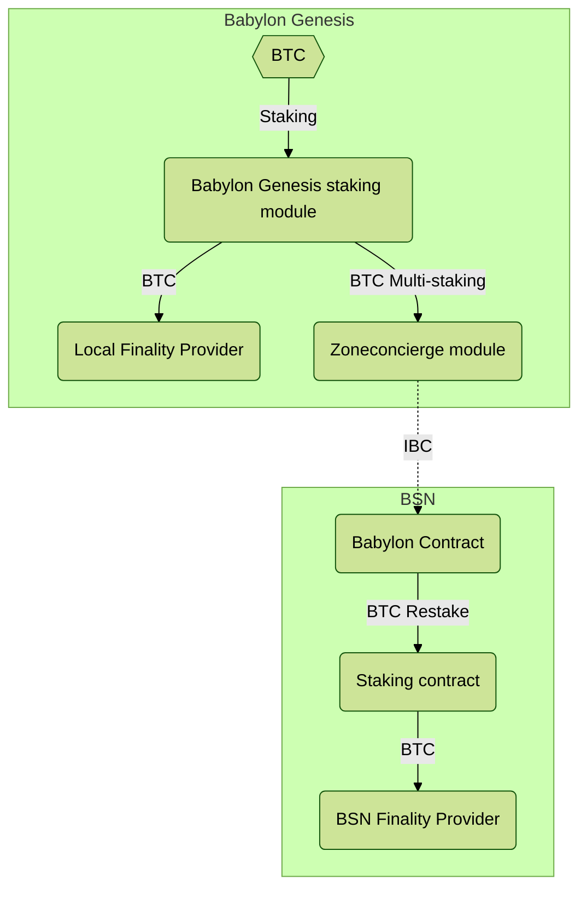
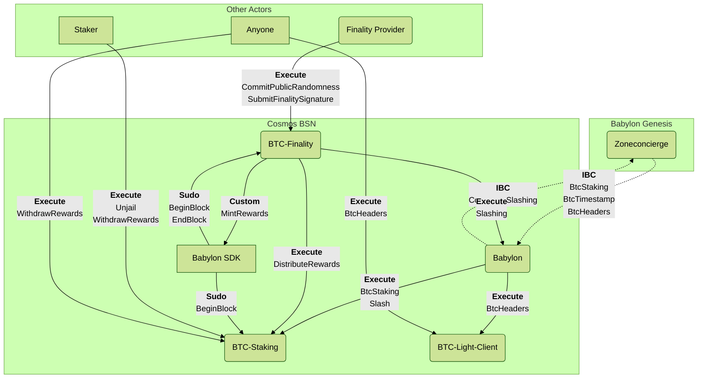

# Cosmos BSN BTC Staking Integration Architecture

This is an architectural overview of the various components of Babylon Staking
integration for Cosmos BSNs.



You can get a good overview of the whole system flow in the above diagram.
The design allows Babylon to provide Bitcoin-based security to multiple chains.

## Modules and Contracts

### Babylon Genesis Side

On the Babylon Genesis side, the main module is the `x/btcstaking` module, which
provides the functionality of Babylon Staking integration. It is responsible
for tracking the staking and unstaking of BTC, as well as providing the
finality providers with the necessary information to operate.
There's also a `x/btcstkconsumer` module, which is responsible for managing the
staking part that is specific to the Consumer chains.
The `x/btcstkconsumer` module interacts with the `x/zoneconcierge` module, which
is responsible for managing the restaking of BTC on the Bitcoin Supercharged
Networks (BSNs).
The Cosmos BSNs are a network of Cosmos chains that are integrated with Babylon
Staking, and receive economic security from Bitcoin.

### Cosmos BSN Side

On the BSN side, the main contract is the `btc-staking` contract, which is
responsible for tracking the staking and unstaking of BTC on the BSN.
It has the necessary information related to delegations of Bitcoin on the BSN.
The `btc-staking` contract interacts with Babylon Genesis through the `babylon`
smart contract, which is responsible for managing the communication between
Babylon and the BSN over IBC.
The `babylon` contract is also responsible for relaying the messages to the
appropriate contracts on the BSN side.
It also deals with contract's instantiation, and with storing the information of
a transfer channel between the BSN and Babylon Genesis, for opt-in rewards
transfer in the form of the BSN's native token, to Babylon Genesis.

Another important contract on the BSN side is the `btc-finality` contract,
which handles the information about signatures and public randomness sent by
the finality providers operating on the BSN. It also deals with vote tallying,
and defines the finalisation status of the blocks on the BSN.

Finally, the `btc-light-client` contract is responsible for maintaining the
light client state of the Bitcoin network on the BSN. It is used to verify
the delegations and timestamping sent through Babylon, and to ensure that the
BSN is in sync with the Bitcoin network.

## Detailed Interfaces

This section provides a detailed overview of the interfaces provided by the
different contracts involved in the Cosmos BSN Staking integration.
It only describes the interfaces that are relevant for Cosmos BSN Staking
integration, and does not cover the full functionality of the contracts. It also
does not cover the different queries that the contracts provide, which can be
found in the contract's documentation.

### Messages

There are four main message types that are used in Cosmos BSN Staking
integration.

- IBC messages, which are used to communicate between Babylon Genesis and BSNs.
- Execute messages, which are used to execute actions on the contracts.
- Sudo messages, which are used by the `babylon` module which is part of
  babylon-sdk to interact with the Cosmos BSN contracts; typically during begin/
  end block processing.
- Custom messages, which are used by the contracts to interact with the
  `babylon` module and execute privileged actions using the Cosmos SDK.

There are also instantiation messages, which are used to instantiate the
contracts on the BSN side, and to set up the necessary channels for IBC
communication between Babylon Genesis and the BSNs.
These messages are not covered in this document, as they are part of the
contract's instantiation process and are typically handled by the integrator
during the chain setup.

There are also queries, that can be used to query the state of the contracts,
that are not covered in this document either.
The queries can be found in the contract's documentation, and are used to query
the state of the contracts and the information related to the delegations,
finality providers, and other information related to the Cosmos BSN Staking
integration.

### Messages Flow

The following diagram outlines the flow of messages between the Babylon Genesis
and BSN sides, as well as the contracts involved, and the babylon-sdk `babylon`
module.


### Messages Overview

#### IBC Messages

##### `babylon` Contract

The `babylon` contract is the main entry point for Cosmos BSN Staking
integration.
It is responsible for handling the IBC messages and relaying them to the 
appropriate contract on the BSN side. It provides the following interface over
IBC:

`BtcStaking` Message:

This IBC packet is used to send the staking and unstaking requests from the
Babylon Genesis BTC staking module to the BSN.
It contains the necessary information about the amount of BTC to be staked or
unstaked, as well as the address of the delegator, the involved transactions on
the Bitcoin network, their validation information, etc.
It also sends information about finality providers entering the BSN network, and
finality providers leaving the network due to slashing on other chains.

`BtcTimestamp` Message:

This IBC packet is used to send the timestamping information from Babylon
Genesis BTC timestamping module to the BSN.
It contains the necessary information about Bitcoin headers and their
timestamps.
This information is forwarded to the `btc-light-client` contract, which
maintains the light client state of the Bitcoin network on the BSN.

`BtcHeaders` Message:

This IBC packet is used to send the Bitcoin headers from Babylon Genesis BTC
timestamping module to the BSN. It contains the necessary information about
the Bitcoin headers, their hashes, heights, and the associated proof of work.
It's also forwarded to the `btc-light-client` contract, which maintains the
light client state of the Bitcoin network on the BSN.

`Slashing` (`ConsumerSlashing`) Message:

#### Execution Messages

##### `babylon` Contract

The `babylon` contract also has an interface for handling the forwarding of
slashing information and evidence upstream, from the BSN to Babylon Genesis.
This is done through the `Slashing` execution handler, which handles the slashing
information and evidence originated on the BSN side (in the  `btc-finality`
contract), and forwards it to the Babylon Genesis `zonconcierge` module, through
the `ConsumerSlashing` inbound (from Babylon's point of view) IBC packet.
This message is part of cascaded slashing, in which the slashing of a finality
provider on a BSN chain results in the undelegation of the involved BTC on 
Babylon Genesis and on other BSN chains as well.

##### `btc-staking` Contract

The `btc-staking` contract is responsible for managing the staking and
unstaking of BTC on the BSN. It provides the following interface:

`BtcStaking` Execution Message: This is the message received by the `babylon`
contract over IBC, forwarded to the `btc-staking` contract. It contains the
necessary information about the staking and unstaking requests, as well as the
finality providers' information, and slashing events from other BSNs or from
Babylon Genesis.

```rust
/// BTC Staking operations
BtcStaking {
    new_fp: Vec<NewFinalityProvider>,
    active_del: Vec<ActiveBtcDelegation>,
    unbonded_del: Vec<UnbondedBtcDelegation>,
    slashed_del: Vec<SlashedBtcDelegation>,
},
```

`Slash` Message:

This is a message sent by the `babylon` contract to the `btc-staking` contract,
to set the staking power of a finality provider to zero when it is found to be
malicious by the finality contract. This is used to handle slashing events
internally or locally to the BSN, and to ensure that the slashed finality
provider is no longer considered for voting and rewards distribution.

```rust
/// Slash finality provider staking power.
/// Used by the babylon-contract only.
/// The babylon contract will call this message to set the finality provider's staking power to
/// zero when the finality provider is found to be malicious by the finality contract.
Slash {
    fp_btc_pk_hex: String
},
```

`DistributeRewards` Message:

This is a message that is part of rewards distribution, sent by the
`btc-finality` contract to the `btc-staking` contract. It contains the rewards
information for the finality providers, which is used to distribute the rewards
to the delegators. The `btc-staking` contract will then handle the distribution
of the rewards to the delegators based on their staking power and the finality
providers' rewards.

```rust
/// `DistributeRewards` is a message sent by the finality contract, to distribute rewards to
/// delegators
DistributeRewards {
    /// `fp_distribution` is the list of finality providers and their rewards
    fp_distribution: Vec<RewardInfo>,
},
```

`WithdrawRewards` Message:

This is a message that can be sent by anyone on behalf of the staker, to claim
the rewards from the `btc-staking` contract. It contains the address of the
staker, which is a Babylon address, and the public key of the finality provider
to which the rewards are associated. The staker's address is used to compute the
equivalent address in the Consumer chain, if the rewards are to be sent to a
Consumer address. The `btc-staking` contract will then handle the withdrawal of
the rewards and send them to the staker's address.
If the rewards are to be sent to Babylon Genesis instead, the staker's address
will be used in the `to_address` field of a ICS20 transfer (`IbcMsg::Transfer`)
message, and the `btc-staking` contract will then send the rewards to the staker
address over IBC.

```rust
/// `WithdrawRewards` is a message sent by anyone on behalf of the
/// staker, to withdraw rewards from BTC staking via the given FP.
///
/// `staker_addr` is both the address to claim and receive the rewards.
/// It's a Babylon address. If rewards are to be sent to a Consumer address, the
/// staker's equivalent address in that chain will be computed and used.
WithdrawRewards {
    staker_addr: String,
    fp_pubkey_hex: String,
},
```

##### `btc-finality` Contract

The `btc-finality` contract is responsible for handling the finality providers'
block signatures, as well as the public randomness commitments associated with
such signatures verification.
It provides the following interface:

`CommitPublicRandomness` Message:

This is a message that can be called by a finality provider to commit public
randomness to the Consumer chain. It contains the necessary information about
the finality provider's public key, the start height of the public randomness,
the number of public randomness values committed, the commitment itself, and the
signature on the commitment. The signature is used to prevent others from
committing public randomness on behalf of the finality provider.

```
CommitPublicRandomness {
    /// `fp_pubkey_hex` is the BTC PK of the finality provider that commits the public randomness
    fp_pubkey_hex: String,
    /// `start_height` is the start block height of the list of public randomness
    start_height: u64,
    /// `num_pub_rand` is the amount of public randomness committed
    num_pub_rand: u64,
    /// `commitment` is the commitment of these public randomness values.
    /// Currently, it's the root of the Merkle tree that includes the public randomness
    commitment: Binary,
    /// `signature` is the signature on (start_height || num_pub_rand || commitment) signed by
    /// the SK corresponding to `fp_pubkey_hex`.
    /// This prevents others committing public randomness on behalf of `fp_pubkey_hex`
    signature: Binary,
},
```

`SubmitFinalitySignature` Message:

This is the main message involved in the finality process. It is used to submit
the finality signature of a block on the Consumer chain. It contains the
necessary information about the finality provider's public key, the height of
the block being signed, the public randomness value used, the singature's proof,
the block app hash, and the signature itself.

```
/// Submit Finality Signature.
///
/// This is a message that can be called by a finality provider to submit their finality
/// signature to the Consumer chain.
/// The signature is verified by the Consumer chain using the finality provider's public key
///
/// This message is equivalent to the `MsgAddFinalitySig` message in the Babylon finality protobuf
/// defs.
SubmitFinalitySignature {
    fp_pubkey_hex: String,
    height: u64,
    pub_rand: Binary,
    proof: Proof,
    // FIXME: Rename to block_app_hash for consistency / clarity
    block_hash: Binary,
    signature: Binary,
},
```

`Unjail` Message:

This message is used to unjail a finality provider that has been jailed due to
offline detection or other reasons. It allows the finality provider to return to
the active set of finality providers. The unjailing can be done by the admin at
any time, or by the finality provider themselves after the jail period has passed. The
`fp_pubkey_hex` field is used to identify the finality provider to be unjailed.

```rust
/// Unjails finality provider.
/// Admin can unjail anyone anytime, others can unjail only themselves, and only if the jail
/// period passed.
Unjail {
    /// FP to unjail
    fp_pubkey_hex: String,
},
```

##### `btc-light-client` Contract

The `btc-light-client` contract is responsible for maintaining the light client
state of the Bitcoin network on the BSN.
It provides the following interface:

`BtcHeaders` Message:

This is a message that can be called by the `babylon` contract to add or update
the Bitcoin headers in the light client.
It contains a list of Bitcoin headers, as well as temporary fields that are used
to initialize the light client with the first header's work and height.

Notably, this message can be called by anyone as well, who can provide valid
Bitcoin headers to extend or update the Bitcoin light client's state.

```rust
/// Add BTC headers to the light client. If not initialized, this will initialize
/// the light client with the provided headers. Otherwise, it will update the
/// existing chain with the new headers.
BtcHeaders {
   headers: Vec<BtcHeader>,
   first_work: Option<String>,
   first_height: Option<u32>,
},
```

#### Sudo Messages

Sudo messages are used by the Babylon SDK `babylon` module to interact with the
Cosmos BSN contracts. They are typically used during the begin and end block
processing.

##### `btc-staking` Contract

`BeginBlock` Sudo Message:

This message is called by the Babylon SDK to signal the beginning of a new block.
It allows the staking module to index the BTC height, and update the power
distribution of Finality Providers.

```rust
/// The SDK should call SudoMsg::BeginBlock{} once per block (in BeginBlock).
/// It allows the staking module to index the BTC height, and update the power
/// distribution of Finality Providers.
BeginBlock {
  hash_hex: String,
  app_hash_hex: String,
},
```

##### `btc-finality` Contract

`BeginBlock` Sudo Message:

This message is called by the Babylon SDK to signal the beginning of a new block.
It allows the finality module to distribute rewards to the finality providers,
and to compute the active finality provider set based on the current block height
and the finality provider's staking power.

```rust
BeginBlock {
  hash_hex: String,
  app_hash_hex: String,
},
```

`EndBlock` Sudo Message:

This message is called by the Babylon SDK to signal the end of a new block.
It allows the finality module to index blocks and tally the finality provider
votes.

```rust
/// The SDK should call SudoMsg::EndBlock{} once per block (in EndBlock).
/// It allows the finality module to index blocks and tally the finality provider votes
EndBlock {
  hash_hex: String,
  app_hash_hex: String,
},
```

#### Custom Messages

Custom messages are used by the Cosmos BSN contracts to interact with the
Babylon SDK `babylon` module.

##### `btc-finality` Contract

`MintRewards` Message:

This privileged message is used to mint the requested block rewards for the
finality providers.
It can only be sent from the finality contract.

```rust
/// MintRewards mints the requested block rewards for the finality providers.
/// It can only be sent from the finality contract.
/// The rewards are minted to the staking contract address, so that they
/// can be distributed across the active finality provider set
MintRewards { amount: Coin, recipient: String },
```
