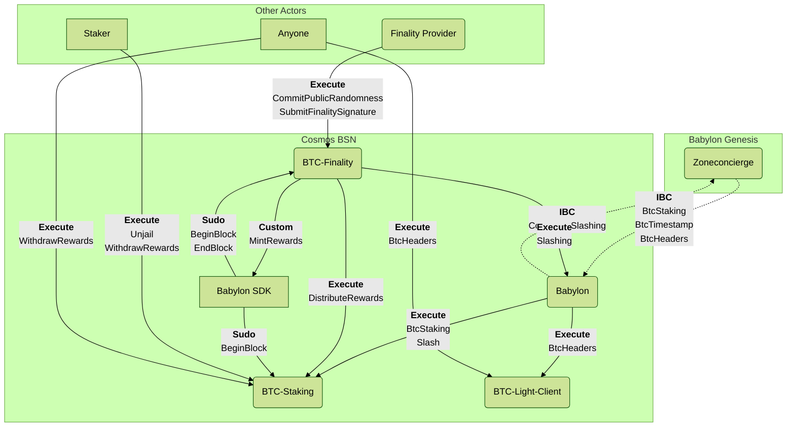

# Cosmos BSN BTC Staking Integration Messages

These are the main messages used in the Cosmos BSN BTC Staking integration.

## Message Flow

The following diagram outlines the somewhat involved flow of messages between
the Babylon Genesis and BSN sides, as well as between the contracts and the
Babylon SDK's `babylon` module.

## Messages Overview

A brief overview of the messages involved in the flow can be found in the
README files of the respective contracts.

- [`babylon` contract](../contracts/babylon/README.md).
- [`btc-staking` contract](../contracts/btc-staking/README.md).
- [`btc-finality` contract](../contracts/btc-finality/README.md).
- [`btc-light-client` contract](../contracts/btc-light-client/README.md).